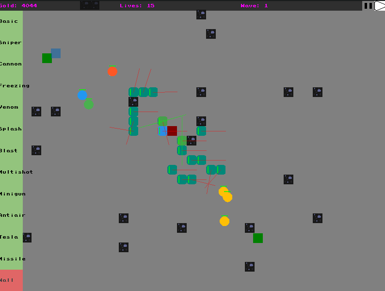

# tdef

Very simple tower defense game with minimalistic graphics and various semi-working towers and enemies. THe goal of this project was to have some game that can actually be played even though it's far from perfect and could still see a lot of improvements.
Allows to create a new game, save it and re-open it later and handle a tower construction mechanism with a gold limit.

# Installation

- Clone the repo: `git clone git@github.com:Knoblauchpilze/tdef.git`.
- Clone dependencies:
    * [core_utils](https://github.com/Knoblauchpilze/core_utils)
    * [maths_utils](https://github.com/Knoblauchpilze/maths_utils)
- Go to the project's directory `cd ~/path/to/the/repo`.
- Compile: `make r`.

Don't forget to add `/usr/local/lib` to your `LD_LIBRARY_PATH` to be able to load shared libraries at runtime. This is handled automatically when using the `make r` target (which internally uses the [run.sh](https://github.com/Knoblauchpilze/tdef/blob/master/data/run.sh) script).

# Usage

The game revolves around endless waves of enemies trying to reach the main portal allowing them to escape. The goal of the game is to prevent them to reach the portal as long as possible by building some towers that aim at killing any enemy.

## Main menu

Allows to quit the application, create a new game or load a previously loaded one.

[Main menu](main_menu.png)

## Load menu

Allows to search for previously saved game and load one of them. The directory parsed to load worlds is not yet configurable and corresponds to [data/worlds](https://github.com/Knoblauchpilze/tdef/tree/master/data/worlds). Note that any file registered in here will be visible in the UI which can lead to failure to load the game (and potentially undefined behavior) in case a file that was not save by the application is loaded.

[Load menu](load_game_menu.png)

## Game

Once the user has selected a game (either through loading a save or by creating a new one), the main game screen appears. The user can build new towers as long as gold is available to do so and upgrade existing ones through the dedicated menu. Towers can also be sold for extra profit.

Regularly waves of enemies will spawn from the dedicated game spawners and mobs will come rushing to the portal. The towers should be placed so as to avoid mobs from penetrating the portal.

[Game](game_menu.png)

## Pause menu

Whenever the player feels like it they can pause the game either through the dedicated menu on the game menu or through the `p` key. Pressing the `p` key will trigger a so called heavy pause where the user can request to save the game or exit the application and is not able to interact anymore with the running game.

If the button within the main UI is chosen, the player can still build towers and potentially use this to react when there's a lot of mobs and the situation is critical.

[Pause menu](pause_menu.png)
